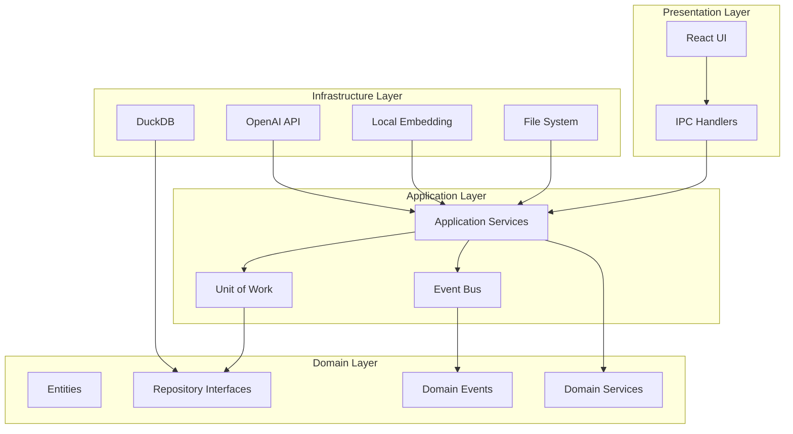
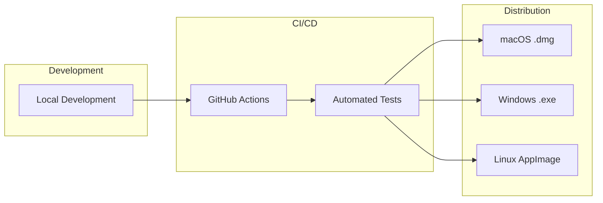

# NovelDrive アーキテクチャ

## 概要

NovelDriveは、クリーンアーキテクチャの原則に基づいて設計された、2層構造の創作支援プラットフォームです。

## システム全体図



## レイヤー詳細

### 1. Domain Layer (ドメイン層)

最も中心的な層で、ビジネスロジックとルールを含みます。

#### エンティティ
- `Knowledge`: 知識・インスピレーション
- `Plot`: プロット
- `Chapter`: 章
- `Character`: キャラクター
- `AgentDiscussion`: エージェント議論

#### リポジトリインターフェース
```typescript
interface IKnowledgeRepository {
  findById(id: string): Promise<Knowledge | null>;
  save(knowledge: Knowledge): Promise<void>;
  searchSimilar(embedding: number[], limit: number): Promise<Knowledge[]>;
}
```

#### ドメインイベント
- `KnowledgeCreated`
- `PlotGenerated`
- `ChapterWritten`

### 2. Application Layer (アプリケーション層)

ユースケースを実装し、ドメインオブジェクトを調整します。

#### 主要サービス
- `KnowledgeApplicationService`: 知識管理
- `PlotGenerationService`: プロット生成
- `WritingService`: 執筆支援
- `MultiAgentDiscussionService`: エージェント議論管理

#### Unit of Work パターン
```typescript
interface IUnitOfWork {
  knowledgeRepository: IKnowledgeRepository;
  plotRepository: IPlotRepository;
  characterRepository: ICharacterRepository;
  // ... 他のリポジトリ
  
  commit(): Promise<void>;
  rollback(): Promise<void>;
}
```

### 3. Infrastructure Layer (インフラストラクチャ層)

外部システムとの統合を担当します。

#### DuckDB統合
- VSS拡張によるベクトル検索
- FTS拡張による全文検索
- カスタム日本語トークナイザー

#### AI統合
- OpenAI API (GPT-4, DALL-E)
- ローカル埋め込み生成 (Transformers.js)

### 4. Presentation Layer (プレゼンテーション層)

ユーザーインターフェースを提供します。

#### React コンポーネント
- `Dashboard`: ダッシュボード
- `AnythingBox`: なんでもボックス
- `KnowledgeGraph`: 知識グラフ（ReactFlow使用）
- `AgentMeetingRoom`: エージェント会議室
- `WritingEditor`: 執筆エディタ

## データフロー

### 1. 情報入力フロー
```
User Input (AnythingBox)
    ↓
IPC Handler
    ↓
AnythingBoxService
    ↓
AI Processing (Inspiration Extraction)
    ↓
KnowledgeApplicationService
    ↓
Knowledge Entity Creation
    ↓
DuckDB Storage
    ↓
Event: KnowledgeCreated
```

### 2. セレンディピティ検索フロー
```
Search Query
    ↓
Embedding Generation
    ↓
Noise Injection
    ↓
Vector Search (DuckDB VSS)
    ↓
Similarity Calculation
    ↓
Results Ranking
    ↓
UI Presentation
```

### 3. プロット生成フロー
```
User Request
    ↓
Knowledge Selection
    ↓
Multi-Agent Discussion
    ├── Writer AI
    ├── Editor AI
    ├── Deputy Editor AI
    └── Proofreader AI
    ↓
Plot Generation
    ↓
Human Review/Edit
    ↓
Plot Versioning
```

## セキュリティ考慮事項

1. **APIキー管理**: 環境変数による管理
2. **データ暗号化**: ローカルストレージの暗号化（将来実装）
3. **入力検証**: SQLインジェクション対策
4. **サンドボックス**: Electron のコンテキスト分離

## パフォーマンス最適化

1. **ベクトル検索**: DuckDB VSSによる高速検索
2. **日本語処理**: TinySegmenterによる軽量トークナイズ
3. **React最適化**: 
   - React.memoによるメモ化
   - 仮想スクロール
   - レイジーローディング
4. **グラフ描画**: 
   - LOD (Level of Detail) による段階的表示
   - ビューポートベースのレンダリング
   - クラスタリング

## 拡張性

### プラグインアーキテクチャ（将来構想）
```typescript
interface IPlugin {
  name: string;
  version: string;
  initialize(): Promise<void>;
  execute(context: PluginContext): Promise<void>;
}
```

### 多言語対応（将来構想）
- i18nフレームワークの統合
- 言語別トークナイザーの追加

## 監視とロギング

1. **アプリケーションログ**: winston による構造化ログ
2. **エラー追跡**: Sentry 統合（将来実装）
3. **パフォーマンス監視**: カスタムメトリクス収集

## デプロイメントアーキテクチャ



## 技術的決定事項

### なぜDuckDB？
1. **組み込み可能**: サーバー不要で軽量
2. **高性能**: カラムナストレージによる高速クエリ
3. **拡張性**: VSS、FTS拡張によるベクトル・全文検索
4. **ACID準拠**: トランザクション保証

### なぜElectron？
1. **クロスプラットフォーム**: 一つのコードベースで全OS対応
2. **Web技術**: React/TypeScriptの活用
3. **ローカルリソース**: ファイルシステムアクセス
4. **オフライン動作**: インターネット接続不要

### なぜクリーンアーキテクチャ？
1. **保守性**: ビジネスロジックの独立性
2. **テスタビリティ**: 各層の独立したテスト
3. **拡張性**: 新機能追加の容易さ
4. **技術的負債の最小化**: 依存関係の明確化