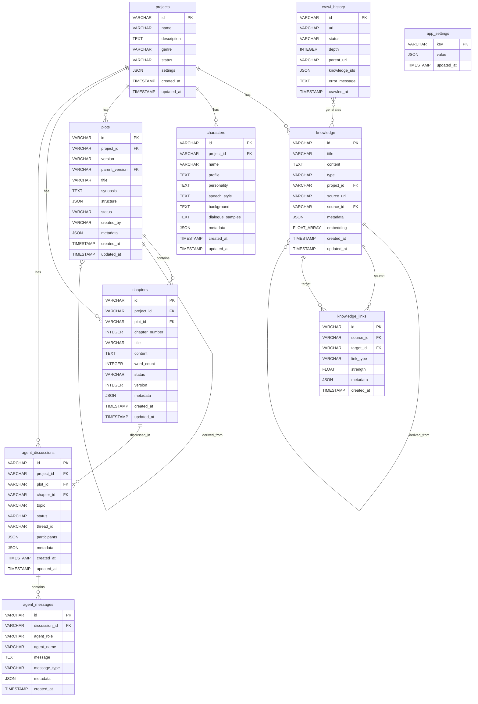

# NovelDrive データベース ER図

## ER図（Mermaid形式）

## リレーションシップの詳細

### 1. projects テーブル（中心的なエンティティ）
- **1対多**: knowledge（プロジェクト固有の知識）
- **1対多**: characters（プロジェクトのキャラクター）
- **1対多**: plots（プロジェクトのプロット）
- **1対多**: chapters（プロジェクトの章）
- **1対多**: agent_discussions（プロジェクトに関する議論）

### 2. knowledge テーブル（知識ベース）
- **多対1**: projects（所属プロジェクト、NULLの場合はグローバル）
- **自己参照**: source_id（派生元の知識）
- **1対多**: knowledge_links（ソースとして）
- **1対多**: knowledge_links（ターゲットとして）

### 3. plots テーブル（プロットバージョン管理）
- **多対1**: projects（所属プロジェクト）
- **自己参照**: parent_version（親バージョン）
- **1対多**: chapters（プロットに含まれる章）

### 4. chapters テーブル（章管理）
- **多対1**: projects（所属プロジェクト）
- **多対1**: plots（所属プロット）
- **1対多**: agent_discussions（章に関する議論）

### 5. agent_discussions テーブル（AI議論）
- **多対1**: projects（関連プロジェクト、NULL可）
- **多対1**: plots（関連プロット、NULL可）
- **多対1**: chapters（関連章、NULL可）
- **1対多**: agent_messages（議論のメッセージ）

### 6. knowledge_links テーブル（知識間の関連）
- **多対1**: knowledge（ソース知識）
- **多対1**: knowledge（ターゲット知識）

### 7. crawl_history テーブル（クロール履歴）
- **多対多**: knowledge（生成された知識、JSON配列で管理）

## 外部キー制約

### CASCADE DELETE（親削除時に子も削除）
- projects → knowledge
- projects → characters
- projects → plots
- projects → chapters
- projects → agent_discussions
- plots → chapters
- agent_discussions → agent_messages
- knowledge → knowledge_links（source/target両方）

### SET NULL（親削除時にNULLセット）
- knowledge → knowledge（source_id）

## インデックス戦略

### 主キー
- すべてのテーブルでVARCHAR型のUUID使用

### ユニークキー
- plots: (project_id, version)
- chapters: (project_id, plot_id, chapter_number)
- knowledge_links: (source_id, target_id)
- crawl_history: (url)

### 通常のインデックス
- 外部キーカラム
- ステータスカラム
- 日時カラム（降順）
- タイプ・カテゴリカラム

## データ整合性の保証

1. **プロジェクト削除時**
   - 関連するすべてのデータが自動削除（CASCADE DELETE）
   - 完全なクリーンアップを保証

2. **知識の派生関係**
   - source_idによる派生元の追跡
   - 派生元削除時もSET NULLで履歴保持

3. **プロットのバージョン管理**
   - parent_versionによるバージョンツリー
   - versionの一意性保証（プロジェクト内）

4. **章の順序管理**
   - chapter_numberの一意性（プロジェクト×プロット内）
   - 章番号の重複防止

5. **知識リンクの双方向性**
   - source_idとtarget_idの組み合わせの一意性
   - 重複リンクの防止